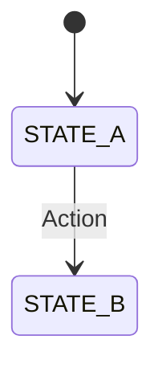

# Documenting Systems

Making systems explicit so they can scale without tribal knowledge.

## CRITICAL: Documentation Sync Requirement

**When modifying code that has associated documentation, you MUST update the documentation in the same PR.**

### What Requires Doc Updates

| Code Change                  | Documentation to Update            |
| ---------------------------- | ---------------------------------- |
| Modify a documented feature  | `docs/features/{feature-name}/`    |
| Change architecture patterns | `docs/architecture/*.md`           |
| Update a library/package     | Package `README.md` if it exists   |
| Change API contracts         | Related feature docs               |
| Modify state management      | `docs/architecture/` if documented |

### How to Check for Related Docs

1. **Check for package README**: Look for `README.md` in the package directory
2. **Check for feature docs**: Search `docs/features/` for related feature names
3. **Check for architecture docs**: Search `docs/architecture/` for system names
4. **Check for inline references**: Grep for the function/component name in `docs/`

### Documentation Update Rules

1. **Update, don't rewrite** - Make targeted changes to existing docs
2. **Keep examples current** - If you change an API, update code examples
3. **Add new sections** - If adding functionality, add corresponding doc sections
4. **Note breaking changes** - Call out if the change affects existing behavior
5. **Update related docs** - If change affects multiple systems, update all relevant docs

### Packages with Documentation

| Package                  | Documentation                     |
| ------------------------ | --------------------------------- |
| `src/lib/google-sheets/` | `src/lib/google-sheets/README.md` |
| `src/lib/i18n/`          | `src/lib/i18n/README.md`          |

---

## Documentation Taxonomy

| Type                | Location                                              | Purpose                             |
| ------------------- | ----------------------------------------------------- | ----------------------------------- |
| Feature Doc         | `docs/features/{feature-name}/{feature-name}.md`      | What the feature does, how it works |
| Acceptance Criteria | `docs/features/{feature-name}/acceptance-criteria.md` | Testable criteria for verification  |
| Architecture Docs   | `docs/architecture/*.md`                              | Cross-cutting systems and decisions |
| Pattern Docs        | `docs/patterns/*.md`                                  | Reusable patterns and anti-patterns |
| Troubleshooting     | `docs/troubleshooting/*.md`                           | Common issues and solutions         |
| Skills              | `.claude/skills/*/SKILL.md`                           | Development patterns for AI         |

---

## Feature Naming Convention

**CRITICAL**: Feature names must be explicit and descriptive. The name should fully describe what the feature does without requiring context.

### Rules

1. **Use full words, not abbreviations**: `checkout-subscription-flow` not `checkout-sub`
2. **Include the domain**: `cart-item-quantity-update` not `quantity-update`
3. **Describe the action or state**: `user-session-expiration-handling` not `session-stuff`
4. **Use kebab-case**: `apple-pay-quickpay-checkout` not `ApplePayQuickpay`
5. **Be specific about scope**: `product-grid-infinite-scroll` not `infinite-scroll`

### Examples

| Bad Name   | Good Name                           | Why                                          |
| ---------- | ----------------------------------- | -------------------------------------------- |
| `auth`     | `user-authentication-flow`          | Specifies it's about user auth, not API auth |
| `cart`     | `shopping-cart-persistence`         | Describes what aspect of cart                |
| `events`   | `event-mode-country-restriction`    | Specifies the exact feature                  |
| `checkout` | `checkout-payment-failure-recovery` | Describes the specific scenario              |

### Anti-patterns

- **Generic names**: `utils`, `helpers`, `misc`, `stuff`
- **Abbreviations without context**: `cfg`, `mgmt`, `proc`
- **Single words**: `payments`, `users`, `products`
- **Implementation details**: `redux-slice`, `api-hook`

---

## Feature Docs

Every feature gets its own folder under `docs/features/{feature-name}/` with two files:

| File                     | Purpose                                                     |
| ------------------------ | ----------------------------------------------------------- |
| `{feature-name}.md`      | Main feature doc: what it does, how it works, key decisions |
| `acceptance-criteria.md` | Testable criteria for verification                          |

### When to Create

**IMPORTANT**: Feature docs are created AFTER the feature implementation is complete.

1. **Complete the implementation** - Write and test all the code first
2. **Define clear acceptance criteria** - Know exactly what needs to be tested
3. **Create the feature folder** - `docs/features/{feature-name}/`
4. **Write the main feature doc** - Document what it does and how it works
5. **Write acceptance criteria** - Testable Given/When/Then statements

**Why after?** Documentation written before implementation often becomes outdated. Writing docs after ensures they reflect the actual implementation.

---

## Main Feature Doc

### Format

```markdown
# {feature-name}

## Overview

1-2 sentences describing what this feature does and why it exists.

## How It Works

Explanation of the feature behavior, user flows, edge cases.

## Key Decisions (optional)

| Decision | Choice | Why       |
| -------- | ------ | --------- |
| X        | Y      | Rationale |

## Related

Links to architecture docs, other features, or external resources.
```

### Example

```markdown
# checkout-payment-failure-recovery

## Overview

Handles payment failures during checkout by preserving cart state and allowing users to retry with alternative payment methods.

## How It Works

When a payment fails:

1. **Error captured**: Payment processor error is logged with full details
2. **User notified**: Safe error message displayed (no sensitive details)
3. **Cart preserved**: All items and quantities remain intact
4. **Retry enabled**: User can select alternative payment method

### Edge Cases

- **Multiple failures**: User can retry unlimited times within session
- **Session timeout**: Cart preserved but user must re-enter payment details
- **Partial failure**: If payment succeeds but order creation fails, payment is voided

## Key Decisions

| Decision              | Choice                         | Why                                    |
| --------------------- | ------------------------------ | -------------------------------------- |
| Error message content | Generic "payment failed"       | Avoid exposing decline reasons         |
| Cart preservation     | Keep in Zustand + localStorage | Survives refresh, no server round-trip |

## Related

- Architecture: [Checkout Flow](../architecture/checkout-flow.md)
```

---

## Acceptance Criteria Doc

Testable criteria that define when the feature is working correctly.

### Format

```markdown
# {feature-name} - Acceptance Criteria

### AC1: [Scenario Name]

- Given: [precondition]
- When: [action]
- Then: [expected result]

## Browser Test Steps (optional)

Steps for manual verification.
```

### Example

```markdown
# checkout-payment-failure-recovery - Acceptance Criteria

### AC1: Payment Error Display

- Given: User submits payment
- When: Payment processor returns an error
- Then: User sees a safe error message (no sensitive details exposed)

### AC2: Cart Preservation

- Given: Payment fails
- When: User views their cart
- Then: All cart items and quantities are preserved

### AC3: Alternative Payment Retry

- Given: Payment failed with one method
- When: User selects a different payment method
- Then: User can complete checkout without re-entering cart items
```

### Why This Structure

- **Explicit naming** → No ambiguity about what feature this covers
- **Separate files** → Feature explanation vs testable criteria have different audiences
- **Given/When/Then** → Testable, unambiguous criteria

---

## Architecture Docs

Cross-cutting system documentation with problems, decisions, and solutions.

### Format

| Include                      | Exclude             |
| ---------------------------- | ------------------- |
| General problem context      | Code examples       |
| Key Decisions with rationale | SQL queries         |
| System-level solutions       | TypeScript snippets |
| State diagrams (Mermaid)     | Function signatures |

### Example

````markdown
# [System Name]

## Overview

Brief description of the general problem this system solves and the solution approach.

## Key Decisions

| Decision | Choice | Why       |
| -------- | ------ | --------- |
| X        | Y      | Rationale |


````

---

## Pattern Docs

Reusable patterns and anti-patterns for consistent development.

### Format

```markdown
# [Pattern Name]

## When to Use

Describe the situation where this pattern applies.

## Pattern

Describe the recommended approach.

## Anti-Patterns

### Don't: [Bad Approach]

Why this is problematic.

### Do: [Good Approach]

The correct alternative.
```

---

## Troubleshooting Docs

Common issues and their solutions for faster debugging.

### Format

```markdown
# [Issue Name]

## Symptoms

What the developer sees (error messages, behavior).

## Cause

Why this happens.

## Solution

Step-by-step fix.

## Prevention

How to avoid this in the future.
```

---

## Skills

Development patterns for AI assistance.

### Format

**Frontmatter**: Name and description with trigger phrase ("Use when...").

**Sections by topic**: Each major pattern gets its own section.

**Checklists**: Actionable verification at the end.

**Codebase-specific scoping**:

- One skill per domain (e.g., `writing-typescript`, `organizing-files`)
- Description includes "Use when..." trigger so AI knows when to apply
- Patterns specific to this codebase, not general knowledge

### Example

```markdown
---
name: skill-name
description: Brief description. Use when [trigger condition].
---

# Skill Name

One line purpose.

## Section 1

[Pattern details]

## Checklist

- [ ] Item 1
- [ ] Item 2
```

---

## Checklists

### Main Feature Doc

- [ ] Feature name follows naming convention (explicit, descriptive, kebab-case)
- [ ] Feature name includes domain context
- [ ] Overview explains what the feature does and why
- [ ] How It Works section explains behavior and user flows
- [ ] Edge cases documented
- [ ] Key Decisions table included (if significant choices were made)
- [ ] Related section links to architecture docs and related features

### Acceptance Criteria Doc

- [ ] Title matches feature name
- [ ] Each AC uses Given → When → Then format
- [ ] AC are testable (not vague)
- [ ] AC cover happy path and error cases
- [ ] Browser test steps included if feature has UI

### Architecture Doc

- [ ] Overview explains general problem and system
- [ ] Key Decisions table with rationale
- [ ] NO implementation code
- [ ] Mermaid diagrams for state machines (if applicable)

### Pattern Doc

- [ ] Clear "When to Use" section
- [ ] Anti-patterns with explanations
- [ ] Concrete examples

### Troubleshooting Doc

- [ ] Symptoms clearly described
- [ ] Cause explained
- [ ] Step-by-step solution
- [ ] Prevention guidance

### Skill

- [ ] Frontmatter with name and "Use when..." description
- [ ] Patterns specific to this codebase
- [ ] Checklist at end
